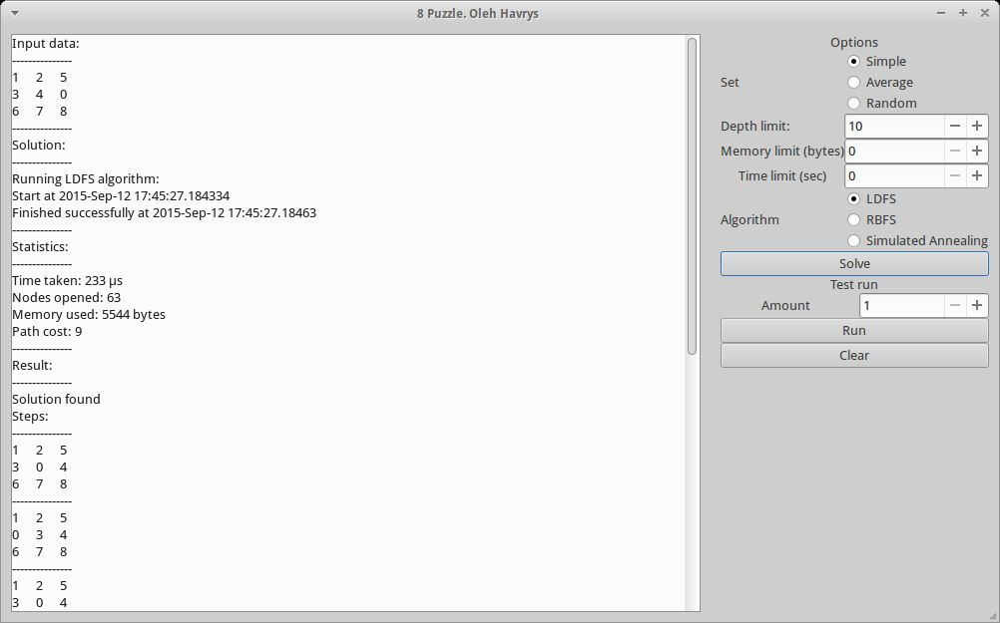

# 8 puzzle solver (Artificial intelligence)
Solves 8 puzzle using different algorithms. It allows to compare algorithm's memory and time usage.

## Supported algoritms
-  Learning Depth-First Search (LDFS)
-  Recursive Best-First Search (RBFS)
-  Simulated Annealing

